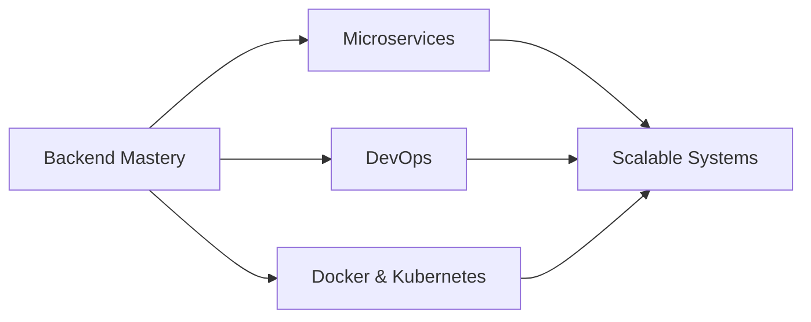

<h1 align="center">
  
</h1>

<p align="center">
  
</p>

<h3 align="center">🚀 Backend Developer | .NET Specialist | Tech Mentor</h3>

<p align="center">
  
  
</p>

---

## 👨‍💻 About Me

```csharp
var developer = new BackendDeveloper
{
    Name = "Tarek ELSabagh",
    Location = "Egypt 🇪🇬",
    Education = "Computer Science @ October 6 University",
    Specialization = ".NET Backend Development",
    CurrentFocus = new[] { "Microservices", "DevOps", "Docker", "Clean Architecture" },
    Experience = new Experience
    {
        Training = "ITI - Information Technology Institute (1 Month Intensive)",
        Community = new[] 
        { 
            "Former Head of Backend Community @ GDG Al-Azhar",
            "Active Member @ GDG DUT"
        },
        Projects = new[] 
        { 
            "E-commerce System", 
            "Hospital Management System",
            "ChatK"
        }
    },
    Passion = "Transforming ideas into scalable, maintainable backend solutions"
};
```

### 🎯 What I Do
- 🔧 Build robust **Web APIs** with **ASP.NET Core**
- 🏗️ Implement **Clean Architecture** principles
- 📊 Design efficient **database systems** with **SQL Server** & **Entity Framework**
- 👥 Mentor students in **.NET technologies** and backend best practices
- 🌱 Continuously learning **Microservices**, **DevOps**, and **Cloud Technologies**

---

## 🛠️ Tech Stack

<div align="center">

### 💻 Languages


### 🚀 Frameworks & Technologies


### 🗄️ Databases


### 🔧 Tools & Platforms


</div>

---

## 📊 GitHub Statistics

<div align="center">
  
  
</div>

<div align="center">
  
</div>

<div align="center">
  
</div>


---

## 💼 Professional Experience

### 🎓 Training & Education
- **Information Technology Institute (ITI)** - 1 Month Intensive Backend Training
  - Hands-on experience with C#, ASP.NET Core, SQL Server, Entity Framework
  - Built real-world applications including E-commerce and Hospital Management Systems
- **ALbait Designe For Software Solutions** - 2 Months ago ASP.NET Developer Internship

### 👥 Community Leadership
- **Former Head of Backend Community** @ GDG Al-Azhar
- **Active Member** @ GDG DUT
- Mentoring students in .NET technologies, database design, and backend architecture

---

## 🎯 Current Learning Path



- 🔄 Microservices Architecture
- 🚢 Docker & Containerization
- ☁️ Cloud Technologies (Azure)
- 🔐 Advanced Security Practices
- 📈 Performance Optimization

---

## 📫 Connect With Me

<div align="center">
  
[](https://www.linkedin.com/in/tarekmmdoh/)
[](mailto:tarekelspagh707@gmail.com)
[](https://api.whatsapp.com/send/?phone=%2B201026547546&text&type=phone_number&app_absent=0)
[](https://www.instagram.com/tarek_mmdoh_/)
[](https://www.facebook.com/tarekelsapagh7)
[](https://discord.com/channels/@me)

</div>

---

## 💡 Quote of the Day

<div align="center">
  


</div>
